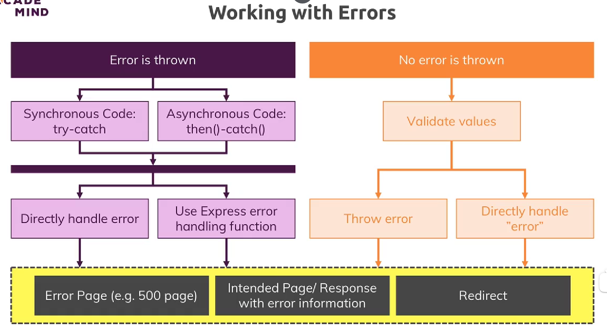

# Error Handling





## Code

### controller

```javascript
module.exports.getProducts = (req, res, next) => {
  try {
    // ...
  } catch (err) {
    const error = new Error("Failed to get products");
    error.httpStatusCode = 500;
    next(error);
  }
};
```

### app.js

```javascript
app.use((error, req, res, next) => {
  res.status(500).render("500");
});
```

## Notice

Please note that errors within the `then().catch()` structure in an asynchronous function will not be caught by the error middleware
